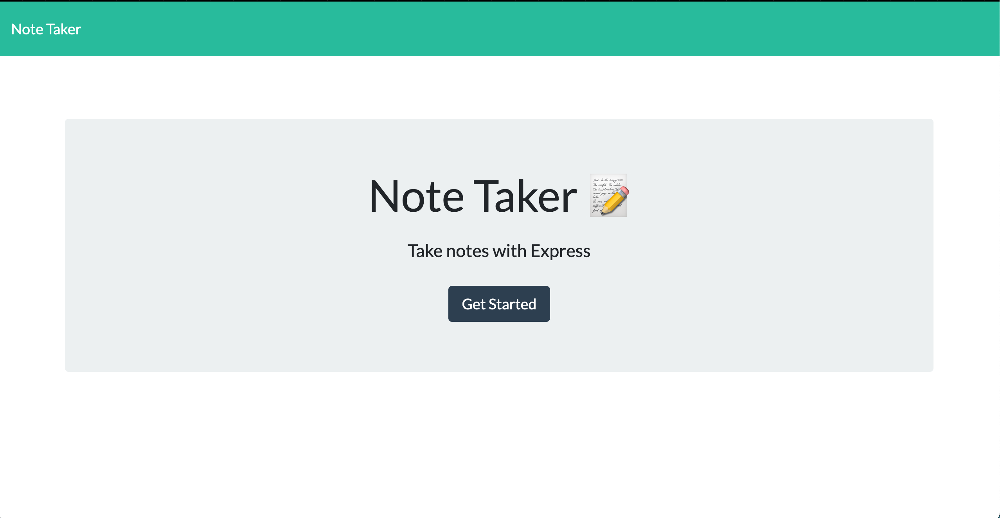

# Homework 11: **Note Taker**

## **Description**  
-------------
A Node.js and express.js application to write and save notes. The note data is retrieved from a JSON file. The user would be able to keep track of older note entries and create new ones.

 ## **How to Use**
 ---------------
- The user would access the application at the following link: [Deployed App](https://ancient-reaches-66462.herokuapp.com/)
  
- The user would start by clicking **Get Started** on the landing page
  

- The user would be able to enter the title of the note and the note text in the text box. The note can be saved or a new one can be added with the buttons at the top right corner.
  
  
 
 - Notes are saved and can be viewed on the left panel 

  

## **Built With**
---------------
- 
- 
- 
- 
- 

## **Contributors**
--------------------
  

- Rudy S. [GitHub](https://github.com/Rudys212)

## **License**
--------------------
MIT License

Copyright (c) 2021 Rudys212

Permission is hereby granted, free of charge, to any person obtaining a copy
of this software and associated documentation files (the "Software"), to deal
in the Software without restriction, including without limitation the rights
to use, copy, modify, merge, publish, distribute, sublicense, and/or sell
copies of the Software, and to permit persons to whom the Software is
furnished to do so, subject to the following conditions:

The above copyright notice and this permission notice shall be included in all
copies or substantial portions of the Software.

THE SOFTWARE IS PROVIDED "AS IS", WITHOUT WARRANTY OF ANY KIND, EXPRESS OR
IMPLIED, INCLUDING BUT NOT LIMITED TO THE WARRANTIES OF MERCHANTABILITY,
FITNESS FOR A PARTICULAR PURPOSE AND NONINFRINGEMENT. IN NO EVENT SHALL THE
AUTHORS OR COPYRIGHT HOLDERS BE LIABLE FOR ANY CLAIM, DAMAGES OR OTHER
LIABILITY, WHETHER IN AN ACTION OF CONTRACT, TORT OR OTHERWISE, ARISING FROM,
OUT OF OR IN CONNECTION WITH THE SOFTWARE OR THE USE OR OTHER DEALINGS IN THE
SOFTWARE.

## **Links** 
---------------
- [GitHub Repo](https://github.com/Rudys212/Homework-11-Note-Taker)

- [Heroku Deployed App](https://ancient-reaches-66462.herokuapp.com/)